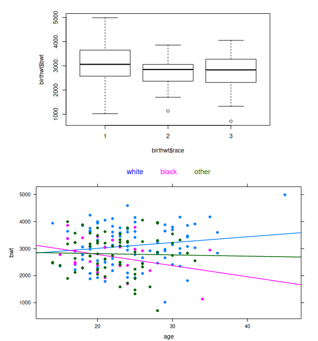
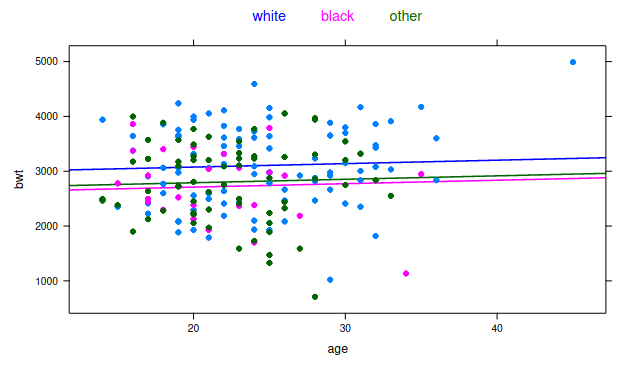

```{r setup, include=FALSE}
knitr::opts_chunk$set(echo = TRUE)
```


```{r}
knitr::knit('Funzioni2.Rmd')
```

## Eda

Let us consider the dataframe birthwt, which contains data on 189 births
at the Baystate Medical Centre, Springfield, Massachusetts during 1986.
The focus is on the variables listed below

```{r echo=FALSE, printr.help.sections="format"}
library(MASS)
help("birthwt")
```

The aim of the study is to analyze the potential relationship between
the response variable bwt and the explanatory variables age and race.
Describe how to perform a preliminary data analysis on this dataframe
using suitable R commands and comment the following plots

Il dataset è costituito da 189 osservazioni e 10 variabili. Per quest'analisi le variabili d'interesse saranno bwt, age e race. Le altre variabili verranno temporaneamente accantonate.


```{r}
birthwt2 <- birthwt[, c("bwt", "age", "race")]
birthwt2$race <- factor(birthwt$race, levels = c(1,2,3), labels = c("white", "black", "other"))
summary.all(birthwt2)
```

bwt è una variabile numerica continua, age è una numerica discreta (intera) e race è una categoriale nominale (non ordinale).

```{r}
par(mfrow=c(1,2))
gsummary.num("bwt", data=birthwt2, normCurve = T)
gsummary.num("age", data=birthwt2, normCurve = T)
gsummary.factor("race", data=birthwt2)
par(mfrow=c(1,1))
```

bwt è caratteriz. da una curva di distribuzione a campana, vagamente simile ad una normale e caratterizzata da una bassa assimmetria e da una curtosi abbastanza vicina a quella di una normale. si osserva soltanto una coda sinistra un po' più pesante e una destra leggera. Il boxplot segnala solo 1 potenziale outlyer a sinistra.

La curva di age è invece un po' più assimmetrica, caratterizzata da code più pesanti (specialmente a destra) e non esattamente riconducibile ad una normale.

La categoriale race non è distribuita uniformamente, ma si hanno più del 50% delle osservazioni per white e forse un po' poche per black.


```{r}
gsummary.norm("bwt", data=birthwt2,  stats = T, statsTest = T)
```

Gli indici di curtosi e assimmetria su bwt sono molto vicini a quelli di una normale.




Dal primo grafico, si osserva una considerevole variazione delle variabilità di bwt in base al fattore race. La variabilità di bwt per il gruppo "white", risulta piuttosto elevata. Al contrario, per i gruppi "black" e "others" si osservano variabilità più ridotte. Ciò potrebbe essere dovuto alla differenza del numero di osservazioni disponibili per ciascun gruppo, quindi potrebbe essere un segnale che stiamo lavorando con relativamente poche osservazioni.

Sempre da tale grafico si osservano leggere differenze dei valori mediani, ma visto il discorso del campione piccolo, tali differenze potrebbero non essere rilevanti. Potrebbe essere interessante effettuare una comparazione delle medie campionarie tramite un test formale per verificarne la rilevanza.

```{r}
cor.check.factor.num("race", "bwt", data=birthwt2, stats = T)
```

Nel secondo grafico invece si sono costruite tre rette di regressione bwt~age, una per ongi gruppo. Si osserva che le tre rette hanno pendenze diverse; in particolare, white cresce mentre others e black calano (la seconda in modo più vertiginoso). Ciò potrebbe essere indice di un'influenza di race su bwt, di un effetto combinato tra race ed age oppure semplicemente della mancanza di dati. 

Sono necessarie ulteriori indagini.


```{r}
cor.check.factor.num("race", "age", data=birthwt2, stats = T)


t.test(birthwt2$age[birthwt2$race=="white"], birthwt2$age[birthwt2$race=="black"])
t.test(birthwt2$age[birthwt2$race=="white"], birthwt2$age[birthwt2$race=="other"])
t.test(birthwt2$age[birthwt2$race=="other"], birthwt2$age[birthwt2$race=="black"])

summary(aov(age~race, data=birthwt2 ))

```


```{r}
cor.check.factor.num("race", "bwt", data=birthwt2, stats = T)


t.test(birthwt2$bwt[birthwt2$race=="white"], birthwt2$bwt[birthwt2$race=="black"])
t.test(birthwt2$bwt[birthwt2$race=="white"], birthwt2$bwt[birthwt2$race=="other"])
t.test(birthwt2$bwt[birthwt2$race=="other"], birthwt2$bwt[birthwt2$race=="black"])

summary(aov(bwt~race, data=birthwt2 ))
```

```{r}
cor.test(birthwt2$bwt, birthwt2$age, method = "pearson")
```


## Analisi

In order to describe the potential relationship between birth weight and
age, taking into account also the factor race, we compare the following
nested models

```{r}
bwt.lm1 <- lm(bwt ~ 1 , data = birthwt)
bwt.lm2 <- lm(bwt ~ age, data = birthwt)
bwt.lm3 <- lm(bwt ~ race + age, data = birthwt)
bwt.lm4 <- lm(bwt ~ race*age, data = birthwt)
```

Describe the four models and comment the results given by the Analysis
of Variance Table, reported below. Moreover, propose some alternative
model selection procedures.

```{r}
anova(bwt.lm1, bwt.lm2, bwt.lm3, bwt.lm4)
```

Si prova a stimare la variabile bwt con 3 (+1) modelli lineari. Il primo è semplicemente il modello nullo (usato più che altro come rifermento per la valutazione dei successivi). Il secondo tiene conto solo del regress. numerico age, il terzo prova ad introdurre il fattore race e il quarto considera entrambi le variabili esplicative + l'effetto iterazione. 

Con la procedura Anova, si confrontano in successione (a coppie) i modelli. Nel confronto tra lm1 e lm2 si osserva un p-value piuttosto elevato, che indicherebbe che non c'è abbastanza certezza per affermare che esiste una correlazione lineare significativa tra age e bwt. 

Il secondo confronto (lm1/lm2) evidenzia la maggior capacità di lm2 di rappresentare i dati, con un p-value non bassissimo ma comunque già discreto (essendo sotto la tipica soglia del 5%, già porterebbe a rifiutare l'ipotesi nulla di maggiore adeguatezza di lm1). Ciò vuol dire che il fattore race sembra significativo.

L'utlimo confronto sembra far emergere lm2 vincitore contro lm3 (non c'è abbastanza evidenza per rifiutare lm2). Ciò vorrebbe dire che l'effetto conbinato di race e age non sembra introdurre grandi migliorie.


Let us consider Model 3 and comment the output obtained by the R
functions summary and plot.

```{r echo=FALSE}
summary(bwt.lm3)
plot(bwt.lm3, which = c(1:4))
```

In questo modello si osserva una bassa significatività generale di tutti i parametri (p-value alti) e del modello stesso (non altissimo p-value nel test F e basso indice di determinazione). L'intercetta è indubbiamente la componente più significativa, race assume una significatività bassa mentre age presenta un p-value veramente molto elevato (che porterebbe a scartare l'ipotesi della sua significatività).

Confrontati alle statistiche di bwt, i residui sembrano elevati. L'indice R^2 così basso indica un'alta variabilità dei dati. 

Dalle diagnostiche:
* si osservano residui di variabilità abbastanza uniforme, ma raggruppati su due grossi cluster
* non si osservano punti influenti particolarmente significiativi
* il qq-plot presenta discostamenti sulle code


Finally, discuss the following graphical output and then suggest how to
proceed with further analyses.



Tale grafico vuole rappresentare il modello lineare lm3, indicando tre rette di pari pendenza e diversa intercetta. La pari pendenza è data dal regressore age, mentre le diverse intercette corrisopondono ai tre livelli del fattore race. Da tale grafico è evidente che il fattore white porta a valori di bwt maggiori rispetto agli altri due livelli, che sono invece comparabili.

Detto ciò, si ribadisce quanto detto nell'analisi preliminare, cioè che probabilimente non ci sono abbastanza dati per effettuare un confronto significativo su queste variabili.

Per effettuare analisi ulteriori, si suggerisce di partire indagando sulle cause dei cluster nei residui, che probabilmente non stanno nelle variabili osservate. Pertanto si suggerisce di:

* studiare i residui parziali per age e race per verificare che i cluster non hanno origine da queste variabili
* eventualmente, estendere prima l'EDA e poi la scelta del modello alle altre variabili.
* se lo scopo dello studio è un confronto esclusivamente su queste variabili, si suggerisce di raccogliere un campione più significativo di dati

---------------------------------------------------------------------------------------

```{r}
birthwt3 <- birthwt

birthwt3$race <- factor(birthwt$race, labels = c("white", "black", "other"))
birthwt3$low <- factor(birthwt$low)
birthwt3$smoke <- factor(birthwt$smoke)
birthwt3$ht <- factor(birthwt$ht)
birthwt3$ui <- factor(birthwt$ui)
birthwt3$ftv <- factor(birthwt$ftv)

# summary.all(birthwt3)
```


```{r}
par(mfrow=c(3,2))

gsummary.num("bwt", data=birthwt3, normCurve = F)
gsummary.num("age", data=birthwt3, normCurve = F)
gsummary.num("lwt", data=birthwt3, normCurve = F)


par(mfrow=c(2,2))

for (v in c("low", "race", "smoke", "ht", "ui", "ftv")) {
  gsummary.factor(v, data=birthwt3)
}

par(mfrow=c(1,1))


```


```{r}
pairs(birthwt3)
as.data.frame(cor(birthwt, method = "spearman"))["bwt"]
```


Tramite un brutale calcolo del coefficente di correlazione di spearman tra tutte le variabili e bwt, si può avere un'idea generare rapida di variabili presentano una correlazione con bwt (si esclude da questo plot la variabile race, che essendo non ordinale impedisce questo tipo di analisi). A parte l'ovvia correlazi. con low, si osserva che esiste una leggera correlazione tra bwt e tutti i fattori smoke, plt, ht e ui. Inotltre sembra esserci correlazione con lwt. 

Si potrebbero escludere dall'analisi ftv e age, invece sembrano promettenti ui ed lwt. Osservando il plot a coppie (per quanto si riesca a fare) si osservano anche potenziali effetti di collinearità (e.g., tra lwt e ui).


```{r}
cor.check.factor.num("ui", "bwt", data=birthwt3, stats = F, doPlotLines = T)
t.test(birthwt3$bwt[birthwt3$ui==0], birthwt3$bwt[birthwt3$ui==1])
summary(aov(bwt~ui, data=birthwt3))
```

```{r}
cor.check.num("lwt", "bwt", data=birthwt3, whichTests=c("pearson", "spearman"))
```


```{r}
cor.check.factor("race", "low", data = birthwt3, stats = F, doTest = T)


cor.check.factor("ui", "low", data = birthwt3, stats = F, doTest = T)
cor.check.factor("smoke", "low", data = birthwt3, stats = F, doTest = T)
cor.check.factor("smoke", "ui", data = birthwt3, stats = F, doTest = T)

```


```{r}
drop1(glm(low~ui+smoke+race+lwt, data=birthwt3, family = "binomial"), test = "F")
drop1(glm(low~ui+smoke+race+lwt, data=birthwt3, family = "binomial"), test = "Chisq")

```


