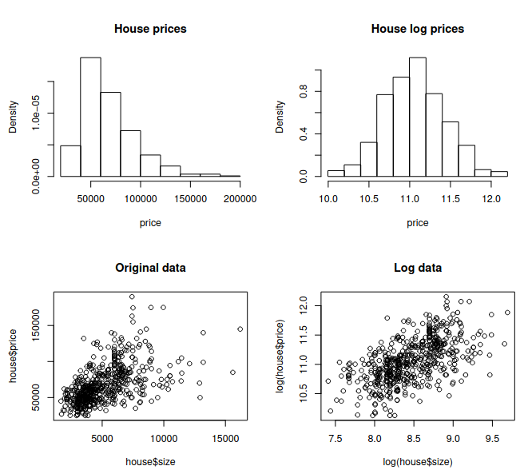

```{r setup, include=FALSE}
knitr::opts_chunk$set(echo = TRUE)
```

```{r}
knitr::knit('Funzioni.Rmd')
```

## EDA

Let us consider the dataframe `house`, which includes information about
the price, the size, the floor, the number of bedrooms (bed) and the
number of bathrooms (bath) of 546 houses. The output of the str command
is given below

```{r echo=FALSE}
house <- read.table("./data/house-prices.dat", header=TRUE)
str(house)
```

A suitable linear regression model can be defined in order to study the
potential relationship between the price, which is the response
variable, and the explanatory variables considered in the dataframe.
Describe how to perform a preliminary data analysis on this dataframe,
using suitable R commands. 


```{r}
nrow(house)
summary(house)
```

Il dataset house è costituito da 546 osservazioni e 5 variabili. 

price e size sono variabili numeriche intere (che però potrebbero benissimo essere considerate continue).

bed, bath e floor sono variabili numeriche intere; per certi nell'EDA viene comodo interpretarle come categoriali ordinali.

```{r}
house2 <- house 
house2$bed <- factor(house$bed)
house2$bath <- factor(house$bath)
house2$floor <- factor(house$floor)

summary(house2)

```

```{r}
for (v in c("price", "size")) {
  summary_numerical(v, data=house2, stats=T)
}
```

Sia price che size seguono una distribuzione a campana con una coda lunga destra, una media superiore alla mediana e una serie di valori elevati che il boxplot indica come outlyer.

```{r}
normality_check(house2$price, stats=T, statsTest = T)
```


```{r}
normality_check(house2$size, stats=T, statsTest = T)

```

In entrambi i casi si osservano assimmetria destra, curtosi elevata e quantili decisamente lontani da quelli di una normale (specie sulle code). Come si discuterà in seguito, probabilmente considerando una scala logaritmica si riesce a raggiungere una distribuzione più normale.

```{r}
for (v in c("bed", "bath", "floor")) {
  summary_categorial(v, data=house2, stats=T)
}
```

Le variabili bed, bath e floor presentano tutte distribuzioni non uniformi. La variabile bed, a giudicare dal grafico a barre, presenta una distribuzione la cui probabilità è più alta per i valori centrali. 

bath sembra seguire una distribuzione di tipo geometrico, mentre floor sembra assumere frequenze molto elevate (e simili) per i valori 1,2 e basse (e di nuovo simili) per 3,4. Si intuisce che le opzioni 1,2 sono le più comuni, mentre 3 e 4 sono rare eccezioni.


```{r}
pairs(house, panel = panel.smooth)

correlation_check_num("size", "price", data=house, stats=T)

par(mfrow=c(2,3))

correlation_check_numfactor("bed", "price", data=house2)
correlation_check_numfactor("bath", "price", data=house2)
correlation_check_numfactor("floor", "price", data=house2)

correlation_check_numfactor("bed", "size", data=house2)
correlation_check_numfactor("bath", "size", data=house2)
correlation_check_numfactor("floor", "size", data=house2)


par(mfrow=c(2,3))

```

Per quanto riguarda le relazioni tra le variabili:

* tra size e price sembra esistere una vaha correlazione, non propriamente lineare, con variabilità che aumenta all'aumentare dei valori (i coef. di pearson e kendal danno entrambi valori mediocri).

* price sembra aumentare al crescere di bed, bath e floor (ma anche in questo caso, sembra aumentare spesso anche la variabilità)

* sembrano esserci leggere relazioni anche tra size e le sovracitate variabili. Per questo motivo, in fase di stesura del modello è opportuno valutare effetti di collinearità.


tint.xyplot <-xyplot(
  price ~ size|floor*bath,
  groups=bed,
  data=house2, 
  aspect=1,
  type=c("p","smooth"),
)

update(tint.xyplot, legend=NULL, auto.key=list(columns=3,points=TRUE, lines=TRUE))


### Domanda

Moreover, consider the following plots and
discuss the possibility of measuring the variables price and size in the
logarithmic scale.



Dai due istogrammi si può osservare come, per far ottenere alla variabile price una distribuzione più simile ad una normale si può applicare una scala logaritmica. Tale tecnica è spesso impiegata per contesti dove si hanno valori che crescono in modo "esponenziale" (e.g., fenomeni economici, sociali o biologici).

Dagli due scatterplot infine si osserva come anche la relazione tra size e price beneficia della scala logaritmica. Riportando le due variabili in scala logaritmica, la distribuzione sul piano diventa più uniforme e il trend lineare diventa più chiaro.

```{r}

normality_check(log(house$price), stats=T, compact = F)

correlation_check_num(log(house$size), log(house$price), stats=T)

```


Si osserva come nel primo caso la distribuzione diventa decisamente più normale, mentre nel secondo caso si ottiene un pattern più lineare rispetto a quanto ottenuto in precedenza. Anche gli indici vari ne beneficiano.


## Modello 

After fitting the regression model
`fit <- lm(log(price) ∼ log(size) + bed + bath + floor, data=house)`,
the following outputs are obtained by the R commands `summary(fit)` and
`plot(fit)`, respectively.

```{r echo=FALSE, eval=FALSE}
fit <- lm(log(price) ~ log(size) + bed + bath + floor, data=house)
summary(fit)

par(mfrow=c(1,2))
plot(fit, lwd = 2, which = c(1:6))
par(mfrow=c(1,1))

```

Describe how to interpret these results, and then suggest how to proceed
with further analyses with particular regard to prediction.

* Dai test t sui regressori del modello, si osserva che a ciascuno di esso è associato un p-value molto buono. Ciò indica che ciascun regressore risulta utile nel modello (forse l'unico regressore su cui vale la pena di valutare la rimozione è bed).

* Dagli indici R^2 ed R^2 aggiustato si può osservare come la varianza spiegata dal modello è circa il 50% della varianza complessiva. Ciò non è un risultato eccellente, ma rimane comunque discreto.

* Dal test F e dal suo p-value, si conferma che il modello contribuisce a spiegare la variabile risposta.

Si osserva che anche dalle varie diagnostiche si ottengono risultati positivi:

* dal grafico dei residui si osserva che non ci sono strani pattern e/o correlazioni con i valori stimati, eccezion fatta di pochi punti sulla coda destra.

* dal qq-plot si osserva che i residui seguono una distribuzione abbastanza normale, eccezion fatta per la coda sinistra. 

* dal grafico dei residui standardizzati si osserva una varianza dei residui abbastanza uniforme, eccezion fatta per la coda destra dove la varianza si riduce (ciò probabilmente è causato dalla scarsità di osservazioni per fitted values elevati).

* le distanze di cook sono molto contenute, pertanto si esclude la presenza di punti con grande effetto leva o influenza. Probabilmente ciò è stato ottenuto grazie alla dimensione elevata del dataset.


In conclusione, il modello sembra piuttosto positivo. Vista la mediocre variabilità spiegata, non sembra adatto ad effettuare previsioni precise, ma rimane comunque un buon modello. 

Per miglorarlo si suggerisce di:

* valutare di rimuovere bed, magari a seguito un test ANOVA (e con il calcolo di AIC e BIC per modelli con e senza bed)

```{r}
fit1 <- lm(log(price) ~ log(size) + bed + bath + floor, data=house)
fit2 <- lm(log(price) ~ log(size) + bath + floor, data=house)

summary(fit2)
```

```{r}
anova(fit2, fit1)
AIC(fit1, fit2)
BIC(fit1, fit2)
```

(dai vari indici e dai risultati del test, si osserva che bed tutto sommato da un piccolo contributo al modello)


* si suggerisce inoltre di valutare meglio eventuali effetti di collinearità tra log(size), bed, bath e floor.

[...]
